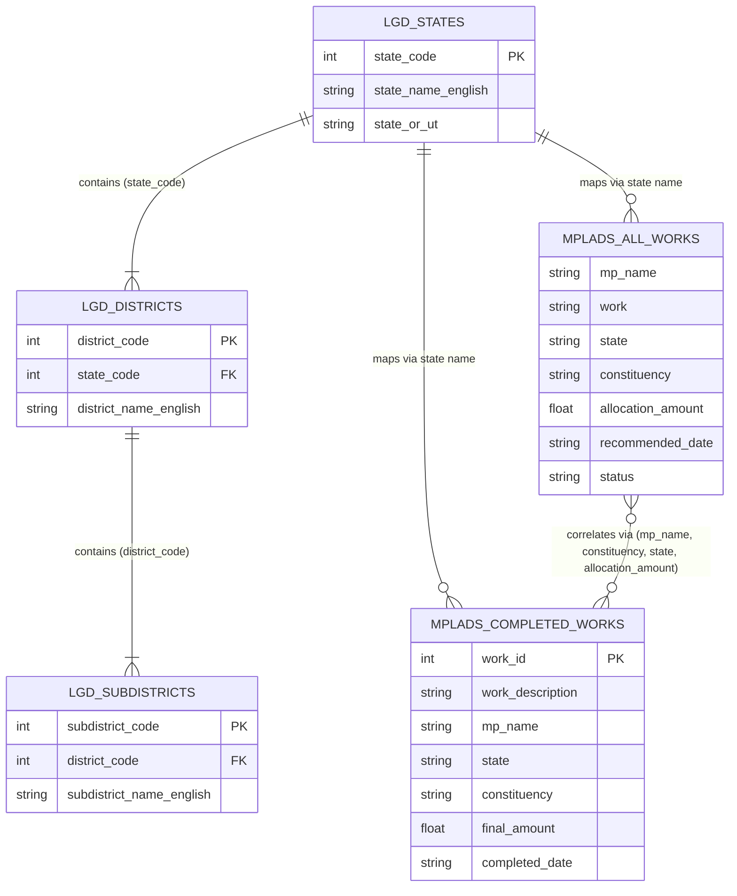

# NidhiDristi Data Dictionary

This document serves as the comprehensive Data Dictionary for Stage 1 of the NIDHIDRISHTI project. It documents all 5 real datasets (raw and cleaned), detailing column definitions, data types, value constraints, missingness handling rules, and dataset relationships.

---

## 1. `mplads_all_works.csv` (Parsed & Cleaned from `MPLADS.csv`)

- **Description**: Contains all recommended, sanctioned, ongoing, and completed MPLADS works registered across Lok Sabha and Rajya Sabha MPs.
- **Source File**: `D:\NidhiDristi\Data\raw\MPLADS.csv`
- **Output File**: `D:\NidhiDristi\Data\cleaned\mplads_all_works.csv`
- **Total Records**: 60,359 rows (100% source-preserved)
- **Primary Key**: Synthetic compound key `(mp_name, work, recommended_date, allocation_amount, village, ward, row_id)` or unique row order.

| Cleaned Column Name | Original Raw Name | Data Type | Nulls Allowed? | Description & Value Constraints | Example Values |
|---|---|---|---|---|---|
| `mp_name` | `MP NAME` | String | No | Full name of the Member of Parliament. | `"Manoj Rajoria"`, `"Gopal Jee Thakur"` |
| `work` | `WORK` | String | No | Title and detailed description of the recommended work item. | `"NA - Street lights"`, `"NA - Installing hand pumps"` |
| `category` | `CATEGORY` | String | No | Category of funding/work type. | `"Normal/Others"`, `"SC"`, `"ST"` |
| `state` | `STATE` | String | No | State or Union Territory name. | `"Rajasthan"`, `"Bihar"`, `"Tamil Nadu"` |
| `constituency` | `CONSTITUENCY` | String | No | Parliamentary Constituency name or Sitting Rajya Sabha designation. | `"KARAULI-DHOLPUR(SC)"`, `"DARBHANGA"` |
| `ida` | `IDA` | String | No | Implementing District Authority name. | `"DISTRICT COLLECTOR DHOLPUR_IDA"` |
| `city` | `CITY` | String | Yes (77.7% empty) | Urban local body / city name if applicable. | `"Rewa"`, `"Firozabad"`, `""` |
| `ward` | `WARD` | String | Yes (78.0% empty) | Municipal ward number or name if applicable. | `"22"`, `"Ward No.13"`, `""` |
| `block` | `BLOCK` | String | Yes (23.5% empty) | Rural development block name. | `"Sepau"`, `"Manigachhi"`, `""` |
| `village` | `VILLAGE` | String | Yes (23.5% empty) | Gram panchayat / village name. | `"Nadauli"`, `"Chandaur"`, `""` |
| `recommended_date` | `RECOMMENDED DATE` | Date (`YYYY-MM-DD`) | No | Date when the MP officially recommended the work. | `"2024-03-04"`, `"2023-12-20"` |
| `allocation_amount` | `ALLOCATION AMOUNT` | Numeric (`Float`) | No | Monetary amount recommended for the work (in INR ₹). | `100000.0`, `500000.0` |
| `ida_approval` | `IDA APPROVAL` | String | No | Approval status from the Implementing District Authority. | `"Action Pending"`, `"Approved by IDA"` |
| `status` | `STATUS` | String | Yes (1.3% empty) | Current implementation status of the work. | `"Unsanctioned"`, `"Sanctioned"`, `"Completed"`, `"Ongoing"` |
| `house` | `HOUSE` | String | No | Parliamentary House. | `"Lok Sabha"`, `"Rajya Sabha"` |

> [!IMPORTANT]
> **Duplicate Preservation Policy**: `MPLADS.csv` contains 4,221 records that share 100% identical values across all 15 attributes with another record. As confirmed by cross-referencing `mplads_completed_works.csv`, these represent multiple distinct physical units (e.g., 3 separate handpumps or street lights recommended on the same date for the same location for ₹1,00,000 each). All 60,359 records are strictly preserved without deduplication to prevent data loss.

---

## 2. `mplads_completed_works.csv`

- **Description**: Contains detailed historical records of completed MPLADS works, including explicit unique Work IDs, completion dates, final amounts, and media flags.
- **Source File**: `D:\NidhiDristi\Data\raw\mplads_completed_works.csv`
- **Output File**: `D:\NidhiDristi\Data\cleaned\mplads_completed_works.csv`
- **Total Records**: 44,028 rows
- **Primary Key**: `work_id` (Integer)

| Cleaned Column Name | Original Raw Name | Data Type | Nulls Allowed? | Description & Value Constraints | Example Values |
|---|---|---|---|---|---|
| `work_id` | `Work ID` | Integer | No (Unique) | Unique identifier for each completed work. | `186485`, `186489` |
| `work_description` | `Work Description` | String | Yes (85 missing) | Detailed text description of the completed work. | `"1 CCTV Camera Under the area of Bela Police Station"` |
| `category` | `Category` | String | Yes (5 missing) | Funding category (e.g. Roads, Sanitation, Water, Public Facilities). | `"Public Amenities"`, `"Roads"` |
| `mp_name` | `MP Name` | String | No | Full name of the MP. | `"DEVESH CHANDRA THAKUR"`, `"Y S Avinash Reddy"` |
| `constituency` | `Constituency` | String | No | Parliamentary constituency name. | `"SITAMARHI"`, `"KADAPA"` |
| `state` | `State` | String | No | State name. | `"Bihar"`, `"Andhra Pradesh"` |
| `house` | `House` | String | No | House of Parliament. | `"Lok Sabha"`, `"Rajya Sabha"` |
| `final_amount` | `Final Amount (₹)` | Numeric (`Float`) | No | Final expenditure amount in INR (₹). | `125000.0`, `500000.0` |
| `completed_date` | `Completed Date` | Date (`YYYY-MM-DD`) | No | Date when the work was completed. | `"2025-08-09"`, `"2024-12-05"` |
| `has_images` | `Has Images` | Boolean | No | Indicates if photo proof exists for the work. | `True`, `False` |
| `average_rating` | `Average Rating` | Numeric (`Float`) | Yes (44,024 nulls) | Citizen / auditor rating (1.0 to 5.0). | `4.5`, `NaN` |
| `ida` | `IDA` | String | No | Implementing District Authority name. | `"DISTRICT MAGISTRATE SITAMARHI_IDA"` |

---

## 3. `03_lgd_districts.csv` (Converted from `03_lgd_districts.csv.xlsx`)

- **Description**: Local Government Directory (LGD) official master reference table of Indian districts, state codes, and census 2011 codes.
- **Source File**: `D:\NidhiDristi\Data\raw\03_lgd_districts.csv.xlsx`
- **Output File**: `D:\NidhiDristi\Data\cleaned\03_lgd_districts.csv`
- **Total Records**: 785 rows
- **Primary Key**: `district_code` (Integer)

| Cleaned Column Name | Original Raw Name | Data Type | Description |
|---|---|---|---|
| `state_code` | `state_code` | Integer | LGD State Code (1 to 36). |
| `state_name_english` | `state_name_english` | String | State name in English. |
| `state_name_local` | `state_name_local` | String | State name in local official language. |
| `state_census2011_code` | `state_census2011_code` | Integer/Float | 2011 Census state code. |
| `district_code` | `district_code` | Integer | Unique LGD District Code. |
| `district_name_english` | `district_name_english` | String | District name in English. |
| `district_name_local` | `district_name_local` | String | District name in local language. |
| `district_census2011_code` | `district_census2011_code` | Integer/Float | 2011 Census district code. |

---

## 4. `04_lgd_states.csv`

- **Description**: Local Government Directory (LGD) official master reference table of States and Union Territories of India.
- **Source File**: `D:\NidhiDristi\Data\raw\04_lgd_states.csv`
- **Output File**: `D:\NidhiDristi\Data\cleaned\04_lgd_states.csv`
- **Total Records**: 36 rows
- **Primary Key**: `state_code` (Integer)

| Cleaned Column Name | Original Raw Name | Data Type | Description |
|---|---|---|---|
| `state_code` | `state_code` | Integer | LGD State Code (1 to 36). |
| `state_name_english` | `state_name_english` | String | State / UT name in English. |
| `state_name_local` | `state_name_local` | String | State / UT name in local language (trimmed of padding). |
| `state_census2011_code` | `state_census2011_code` | Integer/Float | 2011 Census state code. |
| `state_or_ut` | `state_or_ut` | String | Designation: `'S'` for State, `'U'` for Union Territory. |
| `last_updated` | `last_updated` | Date (`YYYY-MM-DD`) | Date of last LGD directory update. |

---

## 5. `05_lgd_subdistricts.csv`

- **Description**: Local Government Directory (LGD) master reference table of subdistricts (Tehsils/Talukas/Blocks).
- **Source File**: `D:\NidhiDristi\Data\raw\05_lgd_subdistricts.csv`
- **Output File**: `D:\NidhiDristi\Data\cleaned\05_lgd_subdistricts.csv`
- **Total Records**: 7,151 rows
- **Primary Key**: `subdistrict_code` (Integer)

| Cleaned Column Name | Original Raw Name | Data Type | Description |
|---|---|---|---|
| `state_code` | `state_code` | Integer | LGD State Code. |
| `state_name_english` | `state_name_english` | String | State name in English. |
| `district_code` | `district_code` | Integer | LGD District Code. |
| `district_name_english` | `district_name_english` | String | District name in English. |
| `subdistrict_code` | `subdistrict_code` | Integer | Unique LGD Subdistrict Code. |
| `subdistrict_name_english` | `subdistrict_name_english` | String | Subdistrict / Tehsil name in English. |
| `subdistrict_name_local` | `subdistrict_name_local` | String | Subdistrict name in local language. |
| `last_updated` | `last_updated` | Date (`YYYY-MM-DD`) | Date of last LGD update. |

---

## Dataset Relationships & Entity Schema Map

